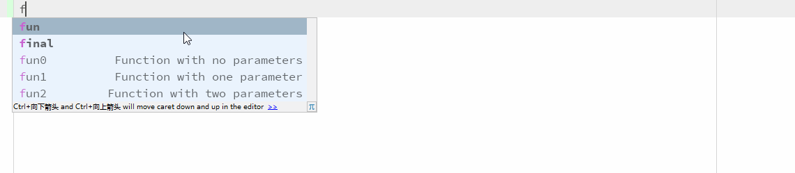

# UKotlinDSLSpringBoot

项目基于 https://github.com/lihengming/spring-boot-api-project-seed 

提供 Kotlin 支持及 DSL 方式编写 SQL 语句 .

## Spring Boot API Project Seed
Spring Boot API Project Seed 是一个基于Spring Boot & MyBatis的种子项目，用于快速构建中小型API、RESTful API项目，该种子项目已经有过多个真实项目的实践，稳定、简单、快速，使我们摆脱那些重复劳动，专注于业务代码的编写，减少加班。

## 示例
查找指定 albumKey 的单条记录


查找指定 userId 的 List<Album>
    

    
指定的 albumKey pageView 字段 +1


### 筛选单条记录
#### 全匹配
select * from album where `id`=${id}
``` Kotlin
fun AlbumService.get(id: Int) : Album?= findOneBy {
    this.id = id
}
```
#### 嵌套条件
select * from album where `id`=${id} or `user_id` = ${userId}
``` Kotlin
fun AlbumService.get(id: Int, userId: Int) = findOne {
    andWhereEq {
        this.id = id
    }
    orWhereEq {
        this.userId = userId
    }
}
```

//TODO 等待填坑.
